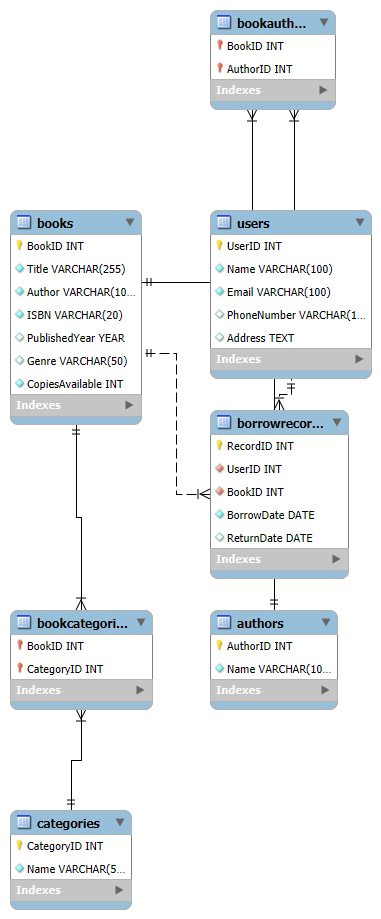

# Library Management System

## Description
This project is a Library Management System implemented using MySQL. It includes a well-structured relational database with tables for users, books, borrowing records, authors, and categories.

## How to Run/Setup
1. Import the `LibraryManagementSystem.sql` file into your MySQL database.
   - Use a MySQL client (e.g., MySQL Workbench, phpMyAdmin) or the MySQL command line:
     ```bash
     mysql -u [username] -p [database_name] < LibraryManagementSystem.sql
     ```
2. Ensure the database is created and populated with the required schema.

## ERD
